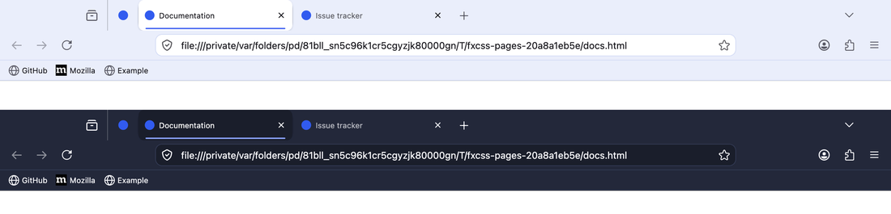
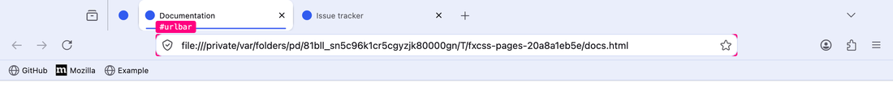
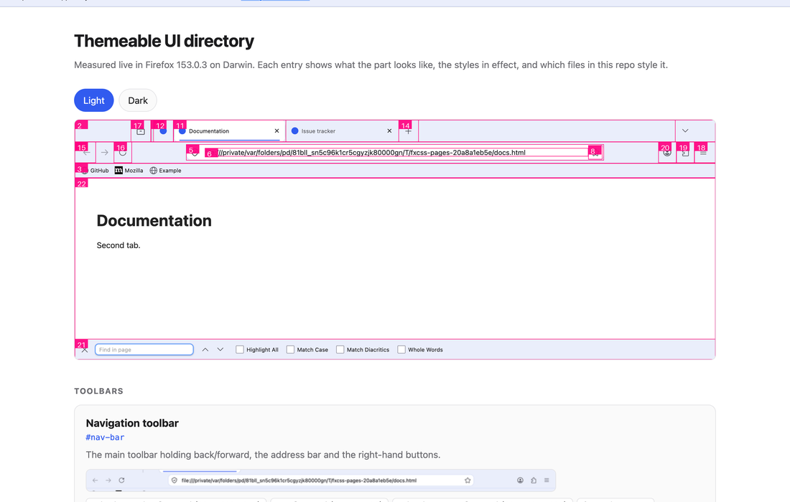
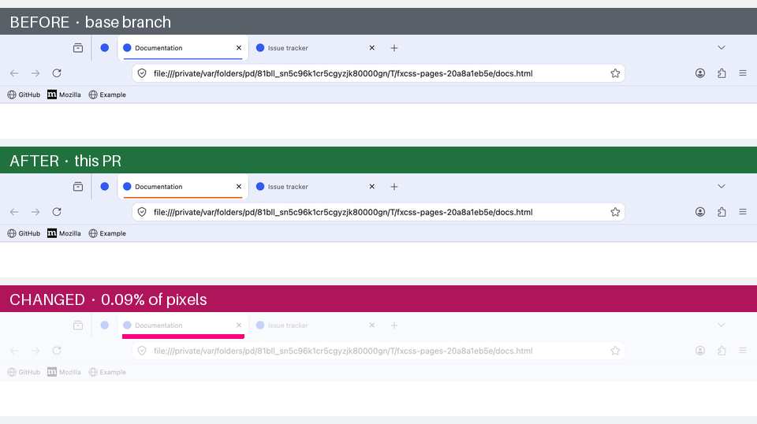

## fxcss

<p align="center">

<br>
A testing toolkit for <code>userChrome.css</code> Firefox themes.<br>
Edit your CSS and see it live, click any part of the UI to get its selector,
and screenshot-test changes in CI.
</p>

## Description

Working on a Firefox theme normally means: edit CSS, restart Firefox, squint,
repeat — and guessing at element names, because the browser's own UI isn't in
any page inspector you're used to.

fxcss removes both problems. It installs your theme into a throwaway profile,
drives Firefox over **Marionette** (Firefox's built-in automation protocol), and
gives you a live-reload loop, an element picker, and a screenshot differ.

Your real Firefox profile is never touched.



<p align="center"><sub><code>examples/minimal-theme</code>, light and dark — every screenshot in this
README was generated by fxcss itself.</sub></p>

## Requirements

- Python 3.9+
- Firefox (any recent release; the toolkit finds it automatically on macOS,
  Windows and Linux, or set `FIREFOX_BIN`)
- `pillow`, only for `catalogue` and `compare`

## Installation

The tidiest way, which keeps fxcss and its one dependency out of your other
Python environments:

```bash
pipx install "fxcss[images] @ git+https://github.com/AdamXweb/fxcss@v0.6.1"
```

Or with pip, pinned to a release so a change here cannot alter your setup
unannounced:

```bash
python3 -m pip install "fxcss[images] @ git+https://github.com/AdamXweb/fxcss@v0.6.1"
```

Either gives you an `fxcss` command. To hack on it, clone and install editable:

```bash
git clone https://github.com/AdamXweb/fxcss.git
cd fxcss && python3 -m pip install -e ".[images]"
```

And if you would rather install nothing at all, the repo runs as-is:

```bash
python3 -m fxcss <command>
```

Run commands from your theme's root (the folder containing `chrome/`), or point
at it with `--theme /path/to/theme`.

## Commands

| Command | What it's for |
| --- | --- |
| [`try`](#fxcss-try) | Download a theme from GitHub and test-drive it |
| [`watch`](#fxcss-watch) | Edit CSS and see it live, no restart |
| [`pick`](#fxcss-pick) | Click any part of the UI to get its CSS selector |
| [`inspect`](#fxcss-inspect) | Look up a selector you already have |
| [`audit`](#fxcss-audit) | Find every selector that no longer matches, and suggest fixes |
| [`changelog`](#fxcss-changelog) | Diff two Firefox builds to see what chrome changed |
| [`snapshot`](#fxcss-changelog) | Record a Firefox's chrome names, to diff against later |
| [`catalogue`](#fxcss-catalogue) | Build a directory of themeable UI parts |
| [`shot`](#fxcss-shot) / [`compare`](#fxcss-compare) | Screenshot and diff two versions |
| [`doctor`](#fxcss-doctor) | Report what your Firefox supports |

### fxcss try

```bash
fxcss try adamXweb/WhiteSurFirefoxThemeMacOS
fxcss try github.com/owner/theme --with compact-tabs
fxcss try owner/theme --info            # report what's there, launch nothing
```

**Test-drive a theme before committing to it.** Downloads it, installs it into a
throwaway profile, and opens Firefox so you can actually use it. Your own profile
is never touched — close the window and nothing remains.

It reports what it found before doing anything:

```
  adamxweb/whitesurfirefoxthememacos  ★614  MIT
    MacOS Big Sur like theme for Firefox on MacOS & Windows.
    latest release   v1.6.3  (2025-07-26)
    latest commit    b10c574  (2025-07-26)  Merge pull request #167 …

  fetching release v1.6.3 …
  theme found at the repository root  (39 stylesheets, 134 KB)

  This theme ships install.sh. fxcss does not run it —
  it installs the files itself, which is all those scripts do.

  Options its README documents:
    -c     Left hand side tab close button
    -p     Makes tabs height compact like current Safari
    …

  Optional stylesheets you can layer on with --with:
    compact-tabs, hideextension, noidentity, tabs-swapclose, …
```

Releases are preferred over branch tips, since that is what the author blessed;
`--commit` takes the latest commit instead, and `--ref` takes any tag, branch or
SHA. `--with name,name` layers on the theme's optional stylesheets so you can see
a variant without hunting through install flags. `--shot dir` captures the
standard screenshots instead of opening a window, and `--keep dir` leaves the
download behind so you can start editing it with `watch`.

#### It does not run the theme's install script

That is deliberate, and worth being plain about: fetching a shell script from a
URL and executing it to preview a stylesheet is a bad trade. Those scripts are,
in substance, `cp -r chrome/ <profile>/` plus flipping a pref — which fxcss
already does. So it finds the script, tells you it exists, parses the options its
README documents, and then installs the files itself.

What is left is the theme's own content: CSS, SVG, and occasionally a `.js` file.
Firefox does not execute a `.js` file sitting in a profile's chrome folder; that
requires an autoconfig hook in the *application* directory, which fxcss does not
create. Archives are size-capped and path-checked on extraction, and symlinks in
them are skipped.

If you decide you want the theme permanently, follow its own install
instructions — that part is between you and the theme.

### fxcss watch

```bash
fxcss watch
```

Opens Firefox with your theme applied and watches `chrome/` and `custom/`. Save
a file in your editor and the running window updates in about 50ms.

The window is yours to drive — open menus, resize it, type in the address bar,
right-click things. Nothing is scripted.

| flag | effect |
| --- | --- |
| `--dark` | start in dark mode, for testing `prefers-color-scheme` rules |
| `--native-menus=false` | make right-click menus themeable (see [Context menus](#context-menus-are-native-on-macos)) |
| `--shot out.png` | write a screenshot after every reload |
| `--no-devtools` | don't enable the Browser Toolbox |

### fxcss pick

```bash
fxcss pick
```

**The answer to "what is this thing called?"** Move the mouse over the browser
window and the element under the cursor is outlined, with its selector shown in
a label:



Click it and your terminal prints everything you need:

```
  toolbarbutton  →  #back-button
  classes   toolbarbutton-1 chromeclass-toolbar-additional
  box       32×36 at (88, 8)
  styles
    color: rgba(46, 52, 54, 0.35)
    border-radius: 8px
    list-style-image: url("chrome://browser/skin/back.svg")
  styled by 11 rules in this theme
    chrome/parts/buttons-fixes.css:5    :root:not([uidensity=compact]) #back-button {
    chrome/parts/custom-icons.css:6     #nav-bar #back-button .toolbarbutton-icon {
    chrome/parts/headerbar.css:76       #nav-bar #back-button:not(#hack) {
```

That last section is the useful part: not just what the element is, but which of
your files already style it, with line numbers. Keep clicking to pick more; Esc
in the browser or Ctrl-C in the terminal stops.

### fxcss inspect

```bash
fxcss inspect '#urlbar'
fxcss inspect '.tab-close-button' --dark
```

The same report, for a selector you already have. Useful for checking whether a
selector still matches anything after a Firefox update — a common cause of
themes quietly breaking.

If it matches nothing, it says so:

```
$ fxcss inspect '#urlbar-background'
no elements match '#urlbar-background' in this Firefox
```

That is a real example, not a contrived one: this repo's own example theme
styled `#urlbar-background` by id, which many older themes still do. The id was
replaced by a class, so the rule silently did nothing and the address bar
rendered unstyled. One command found it; the fix was `.urlbar-background`.

### fxcss audit

```bash
fxcss audit
fxcss audit --patch fix.diff     # write the confident fixes as a patch
fxcss audit --strict             # exit non-zero if anything needs attention
```

**Upgrading a theme after Firefox moved on.** `inspect` answers the question one
selector at a time; `audit` does the whole theme at once. It walks every id and
class your CSS mentions, resolves each against a running Firefox, and shows what
to change — with the real line from your file and the replacement applied:

```
  14 selectors need attention

  RENAMED  #urlbar-background  →  .urlbar-background
           same name, now a class rather than an id

    chrome/parts/headerbar-urlbar.css:52
    - #urlbar-background {
    + .urlbar-background {

  SIMILAR  #appMenu-fullscreen-button  →  #appMenu-fullscreen-button2
           no exact match; closest live name is #appMenu-fullscreen-button2

    chrome/parts/icons.css:198
    - #appMenu-fullscreen-button {
    + #appMenu-fullscreen-button2 {
```

That output is real — it is what this finds in a long-running theme. The
`…-button2` pattern is how Firefox has been versioning app-menu controls, and it
breaks menu styling silently.

Findings come in three kinds:

| | meaning |
| --- | --- |
| **RENAMED** | The same name exists, but as a class instead of an id, or the reverse. The suggestion is exact. |
| **SIMILAR** | No exact counterpart, but a close name exists. Usually a Firefox suffix change, or a typo in your CSS. |
| *unresolved* | Nothing close. Listed separately with `--all` and **not** counted as a problem — normally an element that only appears in a state fxcss cannot reach, not one that was removed. |

That last distinction is the point. Reporting every unmatched selector as broken
would be noise; a theme legitimately styles things that only exist in private
windows, on other platforms, or inside popups.

Suggestions are inferred from the live browser, not from a hardcoded list of
Firefox versions, so they keep working for releases that came out after this
tool did.

`--patch` writes a unified diff of the **RENAMED** findings only — the ones where
the replacement is certain. Review it, then `git apply`. SIMILAR findings are
deliberately excluded: they are usually right, but "usually" is not good enough
to rewrite your CSS unattended.

### fxcss changelog

```bash
fxcss changelog --firefox /path/to/old/firefox --against /path/to/new/firefox
```

**What actually changed between two Firefox releases.** Collects every chrome id
and class from both builds, diffs them, and tells you which of the removals your
theme depends on:

```
  Firefox 140.13.0 → 153.0.3
    52 chrome names gone, 221 new

  2 of them are used by this theme:
    #urlbar-background          chrome/parts/headerbar-urlbar.css:52
    #urlbar-go-button           chrome/parts/buttons-fixes.css:202
```

Point it at an ESR build and current release to see what a year of Firefox did
to your theme, or at a Beta to find out what is about to break before your users
do. `--show-all` lists every name that changed, not just the ones you use.

You do not need to keep an old browser around. `fxcss snapshot --out
baseline.json` records what a Firefox has; commit that file and compare later
with `--baseline`:

```bash
fxcss snapshot --out .fxcss/firefox-140.json     # once
fxcss changelog --baseline .fxcss/firefox-140.json
```

#### Watching Firefox for breakage

Firefox ships every few weeks, and a theme does not break loudly when it
renames something. A scheduled job can audit each channel and tell you before
your users find out — Beta and Nightly give weeks of warning.

`examples/firefox-watch.yml` is a working workflow that does this: it downloads
release, beta and nightly, audits the theme against each, opens a **pull
request** when the fixes are ones `--patch` is certain about, opens an issue
when they are not, and closes the issue once the channel is clean again.

#### Unused and unreachable code

`audit` also reports housekeeping, in its own section, separate from breakage:

- **Stylesheets nothing imports.** Files under `chrome/` unreachable by
  following `@import` from `userChrome.css`. Sheets in a `custom/` or
  `optional/` folder are excluded — being opt-in is the point of those.
- **Custom properties used but never set**, where an unthemed Firefox does not
  provide them either. These are usually typos: the `var()` silently falls back.
- **Custom properties set but read nowhere.** Reported cautiously — setting
  `--arrowpanel-background` exists precisely so Firefox's own rules pick it up,
  so this section excludes every name an unthemed Firefox resolves.

That last check is why `audit` briefly starts a second, unthemed browser: asked
of the themed one, every name resolves, because the theme set it.

Pass `--no-unused` to skip the section.

**Should it gate CI?** Report it, don't fail on it. `--strict` covers selectors
that no longer match, which is real breakage. Unused code is tidiness, and a
tidiness check that blocks merges gets disabled. The example CI here runs
`audit --strict` and lets the unused section be advisory.

### fxcss catalogue

```bash
fxcss catalogue --open
```

Builds an HTML directory of the UI parts a theme can target. For each one: a
cropped screenshot of the real element in light and dark, its selector, the
styles in effect, and every rule in your theme that targets it. Plus an
annotated overview screenshot with each part numbered.



Everything is measured from a running browser rather than hardcoded, so it stays
honest as Firefox changes — an element that no longer exists is reported as
missing rather than quietly documented.

Add `--self-contained` to also get a single `catalogue.html` with the images
inlined, for attaching to an issue.

### fxcss shot

```bash
fxcss shot --out shots/before
```

Captures a set of views — browser window, focused address bar, find bar, each in
light and dark — as PNGs.

#### Against real websites

```bash
fxcss shot --out shots --url https://github.com/AdamXweb/WhiteSurFirefoxThemeMacOS
fxcss shot --out shots --only-live --url https://example.com --url https://news.ycombinator.com
```

Captures the theme against live sites, light and dark, for showing it off —
README screenshots, release notes, an issue thread.

These land in `<out>/live/` and are **never part of a comparison**. That is the
whole point of keeping them separate: someone else's page can change its
content, title or favicon between two runs, and a theme pull request should not
be blamed for it. `compare` only looks at PNGs at the top level, so they are
excluded by construction rather than by a rule someone has to remember.

`examples/showcase.yml` automates it — regenerate on every release, publish to a
`showcase` branch, and link stable raw URLs from your README.

### fxcss compare

```bash
fxcss compare --base shots/before --head shots/after --out diff/
```

Diffs two sets and writes one stacked **before / after / changed-pixels** image
per view that differs. Views that render identically are reported rather than
pictured, so you only look at what actually changed.



<p align="center"><sub>One changed value — the accent colour behind the active tab. The bottom panel
highlights the 0.09% of pixels that moved.</sub></p>

This is what makes it useful in CI: render your theme at the base commit and at
a pull request, and the diff shows a reviewer exactly what the change does. See
[Using it in CI](#using-it-in-ci).

### fxcss doctor

```bash
fxcss doctor
```

Reports your Firefox version, whether `userChrome.css` is enabled, whether
context menus are themeable on your platform, and how many stylesheets your
theme has. Start here if something isn't behaving.

## Inspecting the UI with devtools

Firefox's normal inspector only sees page content. The **Browser Toolbox** is
the version that can inspect the browser's own UI, and it's off by default
behind four prefs. fxcss turns them on in its throwaway profile, so in `watch`
and `pick` you can just press:

- **macOS** — `Cmd+Opt+Shift+I`
- **Windows / Linux** — `Ctrl+Alt+Shift+I`

You get a full inspector over the browser chrome: hover to highlight, read
computed styles, and live-edit rules to try things before committing them to
your CSS. `fxcss pick` is the fast path for "what is this called"; the Browser
Toolbox is the thorough one for "why is this rule not winning".

## Using it in CI

`shot` and `compare` are designed to run on a hosted runner. The shape is:
check out the base revision and the pull request revision, render both, compare,
and publish the result.

```yaml
- run: pip install "fxcss[images] @ git+https://github.com/AdamXweb/fxcss"
- run: fxcss shot --theme base --out shots/base
- run: fxcss shot --theme head --out shots/head
- run: fxcss compare --base shots/base --head shots/head --out out/ --platform ${{ runner.os }}
```

Two things to know before wiring this up:

- **Don't use headless mode.** Firefox headless renders no browser chrome at
  all, so a headless screenshot is an empty window. Runners need a real display;
  macOS and Windows runners have one, Linux needs `xvfb-run`.
- **Pull requests from forks get a read-only token.** If you want the result
  posted as a comment, build the images in the `pull_request` job (no write
  permissions, no secrets) and publish from a separate `workflow_run` job.

`.github/workflows/ci.yml` in this repo runs the whole thing against
`examples/minimal-theme` on macOS and Windows, and is a working reference.

## Things worth knowing

### Context menus are native on macOS

Firefox sets `widget.macos.native-context-menus` to `true` by default, which
means **macOS draws right-click menus itself and CSS cannot style them at all**.
`menupopup` and `menuitem` rules have no effect there. They do apply on Windows
and Linux.

`fxcss doctor` reports the setting for your platform, and
`fxcss watch --native-menus=false` switches Firefox to XUL menus so you can work
on that styling from a Mac.

### Popups can't be screenshotted

Menus and the app menu are separate OS-level windows, so they appear in neither
a Marionette chrome screenshot nor a `drawWindow` rasterisation of the browser
window. Capturing the whole screen instead is worse: it depends on window
stacking and picks up whatever else is on your desktop. Every view `shot`
captures is therefore an in-document surface.

You can still *look* at popups in `watch`, and inspect them with the Browser
Toolbox. They just can't be captured.

### Why not Selenium?

Marionette is plain TCP with length-prefixed JSON, so the client here is about a
hundred lines of standard library. No geckodriver to keep in step with your
Firefox version — a common source of CI breakage — and no dependency to install
for the core commands.

More importantly, screenshots are taken in Marionette's **chrome context**,
which captures the browser window's own document. An ordinary WebDriver
screenshot only captures page content, so toolbars and tabs would never appear
at all.

### Reproducibility

Screenshot comparison only works if an unchanged theme renders identically
twice. The throwaway profile pins what would otherwise drift: first-run tours,
telemetry prompts, update checks and animations are off; pages are local files
rather than live sites; and Nimbus/Normandy are disabled so Mozilla can't switch
a toolbar feature on remotely between two runs.

Two CSS rules hide artifacts of the harness itself — the robot icon Firefox
shows in automated sessions, and the rollout-gated IP Protection button. Neither
is part of your theme.

Each session also picks its own Marionette port. Firefox's fixed default of 2828
means a browser leaked by an earlier run would silently accept the next
session's connection, which shows up as your theme mysteriously not applying.

## Contributing

Issues and pull requests welcome — particularly landmark definitions for UI
parts the catalogue doesn't cover yet, and reports of selectors that changed in
a new Firefox release.

## How this was built

fxcss was written with the assistance of **Claude** (Anthropic's Claude Opus 5),
working alongside [@AdamXweb](https://github.com/AdamXweb). Every change was
reviewed by a human before it landed.

Which commits are which is recorded in the history rather than asserted here:

| Author | |
| --- | --- |
| **`adamXbot`** | AI-assisted. Every one carries a `Co-Authored-By: Claude` trailer. |
| **`AdamXweb`** | Adam. |

Both halves of that are checkable:

```bash
git log --format='%an'                        # who authored each commit
git log --format='%b' | grep Co-Authored-By   # which were AI-assisted
```

Behaviour is not taken on trust either. CI runs on macOS and Windows on every
push and asserts the comparison in **both** directions: an unchanged theme must
render identically across runs, and an obvious CSS change must be detected.
That check found most of the real bugs in this tool — a random temp path leaking
into the address bar, Firefox flashing the find bar yellow as it opens, a
scrollbar appearing in one private-window capture and not the next — none of
which review had caught.

## Credits

Built while adding visual PR previews to
[WhiteSurFirefoxThemeMacOS](https://github.com/AdamXweb/WhiteSurFirefoxThemeMacOS),
and generalised so it works for any userChrome theme.

## License

[MIT](LICENSE)
